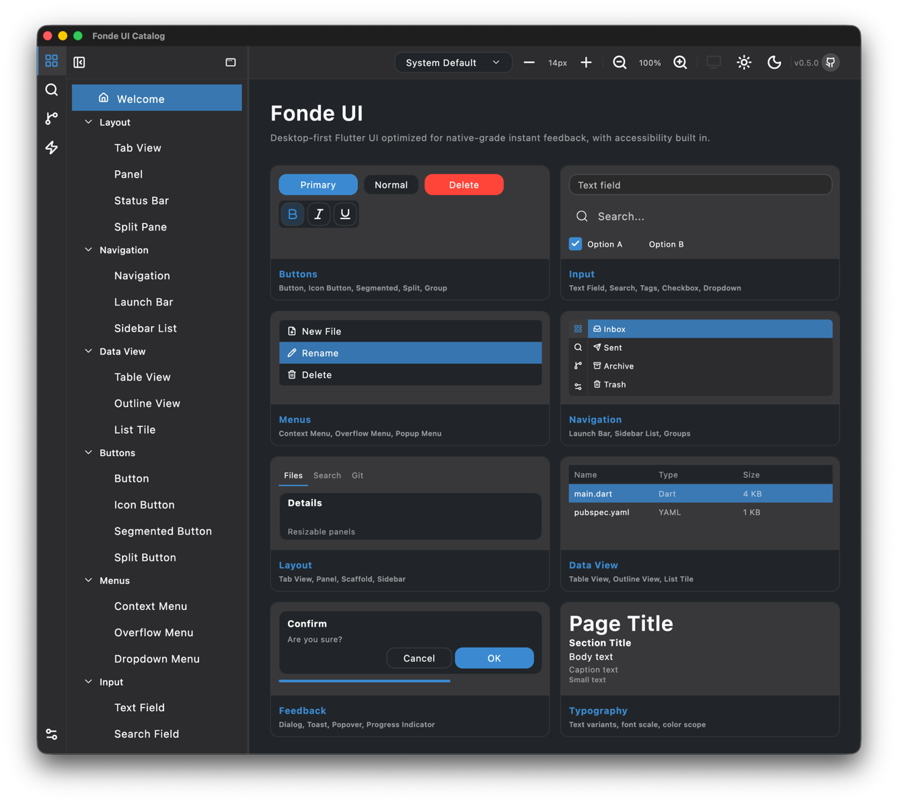
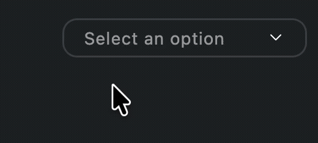

# Fonde UI

**Desktop-first Flutter UI utility components optimized for native-like interaction, with zoom scaling support.**

* **Fonde** (pronounced *fond*) — named after *fond de veau*.



**[Live Demo](https://szktty.github.io/fonde-ui/)**

## Overview

`fonde_ui` is a Flutter UI utility component library for desktop applications, developed for [RinneGraph](https://github.com/szktty/rinne-graph). It provides improved multi-pane layouts, instant feedback interaction, and zoom scaling support out-of-the-box.

## Platform Support

- Flutter: `>=3.41.2`
- Dart: `^3.7.0`
- Platforms: macOS, Windows, Linux, iOS, Android

## Goals

Fonde UI's goal is to provide **operational and visual comfort** in desktop apps — achieving the same feel as native applications using Flutter. In Fonde UI, comfort takes priority over visual richness.

## Features

- 🖥️ **Desktop-first** — Optimized for desktop applications over mobile, with interactions and layouts tailored for keyboard, mouse, and large screens
- ⚡ **Native-like interaction** — Instant feedback and restrained animations for smooth operation
- 🎨 **Flat design** — Clean, simple visuals inspired by Figma, with smooth-curve corners throughout
- 🪟 **Multi-pane layout** — Built-in support for a three-pane window with a vertical Launch Bar
- 🔍 **Zoom scaling support** — All components scale uniformly with zoom, ensuring a consistent look at any size
- 🔋 **Batteries included** — Handy widgets tuned for desktop applications, ready to use out of the box
- 🏠️ **Customizable appearance** — Supports dark mode, color themes, and custom fonts
- 🌐 **Cross-platform** — Runs on macOS, Windows, Linux, iOS, and Android


## UI Utility Components

### Layout

- Scaffold — three-pane window layout with Launch Bar, resizable primary/secondary sidebars, and main content area
- Master Detail Layout — master/detail split with synchronized selection
- Tab View — tab bar and content area
- Split Pane — draggable resizable split pane with minimum width constraints
- Panel — themed container with background and border
- Section
- Scroll View

### Navigation

- Toolbar — main, primary/secondary sidebar variants
- Launch Bar — vertical icon navigation bar with top/bottom sections; collapses to icons-only
- Sidebar — resizable primary and secondary areas; standard and floating panel (macOS) styles
- Sidebar List — `filled`, `subtle`, and `inset` item styles

### Data View

- Table View — sortable/resizable/reorderable columns, single/multi-row selection, row reordering, leading/trailing row widgets, and visual customization (header divider, column dividers, stripe rows)
- Outline View — collapsible tree-style list
- List Tile — single/double-tap aware, hover highlight

### Buttons

- Button — squircle corners, multiple size and style variants
- Icon Button
- Icon Label Button
- Segmented Button
- Split Button — primary action with secondary dropdown
- Button Group
- Overflow Menu Button — collapses excess items into a popup menu

### Menus

- Context Menu
- Overflow Menu
- Dropdown Menu — macOS-style press-drag-release selection, keyboard navigation. No submenu support yet.

  

- Popup Menu

### Input

- Text Field — zoom-scalable, squircle border, cursor and selection fully functional on desktop
- Search Field — with optional suggestion overlay
- Tags Field — inline tag editing; keyboard navigation (`←`/`→` to move between tags, `Backspace` for 2-step delete, `Delete`, `Escape`)
- Number Field — numeric input with − / + buttons, min/max/step
- Checkbox — rectangle/circle shape; filled/outline/iconOnly fill style
- Radio Button
- Switch — toggle switch; compact and wide styles
- Expansion Tile
- Date Picker — monthly calendar, single and range selection
- Slider
- Color Picker — HSV canvas, hue/alpha sliders, palette swatches, eyedropper

### Feedback

- Dialog — modal dialog
- Confirmation Dialog
- Toast
- Snack Bar
- Popover — directional, auto-dismiss, animated
- Notification Overlay
- Tooltip
- Linear Progress Indicator
- Circular Progress Indicator

### Typography

- Text — semantic variants: page title, body, caption, code, table, and more

### Visual

- Divider
- Tag
- Container
- Selection Decorator
- Rectangle Border — Figma-style squircle border container
- Eye Dropper — in-window color sampling with zoom loupe

### Interaction

- Gesture Detector — single/double tap without delay; hover and cursor support
- Draggable
- Shortcut Scope

### Platform

- Platform Menus — macOS native menu bar

### Design Tokens

- Spacing — zoomable spacing (4px grid)
- Padding — zoomable padding
- Border Radius — smooth squircle curve
- Border

## State Management

fonde_ui uses plain Flutter state management (`ChangeNotifier` + `InheritedWidget`).

Theme, accessibility config, and sidebar state are accessible via `BuildContext` extensions from any widget's `build` method.

## Setup

Add to your `pubspec.yaml`:

```yaml
dependencies:
  fonde_ui: ^0.9.0
```

### Minimal Example

```dart
import 'package:fonde_ui/fonde_ui.dart';

void main() {
  runApp(
    FondeApp(
      title: 'My App',
      home: FondeScaffold(
        toolbar: MyToolbar(),
        content: MyContent(),
      ),
    ),
  );
}
```

`FondeApp` wraps `MaterialApp` internally.

### FondeScaffold — Multi-pane Layout

`FondeScaffold` provides the top-level window layout for desktop apps:

```
[ Launch Bar | Primary Sidebar | Main Content | Secondary Sidebar ]
```

- **Launch Bar** — vertical icon bar on the far left, split into top (main) and bottom (meta) sections
- **Primary Sidebar** — resizable (240–480px), collapsible; supports standard and floating panel (macOS) styles
- **Secondary Sidebar** — resizable (200–400px), collapsible
- **Main Content** — fills remaining space

```dart
FondeScaffold(
  toolbar: FondeMainToolbar(children: [...]),
  launchBar: FondeLaunchBar(
    topItems: [
      FondeLaunchBarItem(icon: LucideIcons.house, label: 'Home', logicalIndex: 0, onTap: () {}),
    ],
    bottomItems: [
      FondeLaunchBarItem(icon: LucideIcons.settings, label: 'Settings', logicalIndex: 99),
    ],
    selectedIndex: 0,
  ),
  primarySidebar: FondeSidebar(
    child: FondeSidebarList(children: [...]),
  ),
  content: MyMainContent(),
)
```

Sidebar visibility and width are controlled via `FondeSidebarControllerScope`:

```dart
// Toggle primary sidebar
FondeSidebarControllerScope.primaryOf(context)?.toggle();
```

## Documentation

Full documentation is under preparation. In the meantime, refer to the `example` app for usage demonstrations.

For LLM context, load `llms.txt`.

## License

Apache License 2.0

## Apps Created with Fonde UI

- [RinneGraph](https://github.com/szktty/rinne-graph) — graph-based database app
